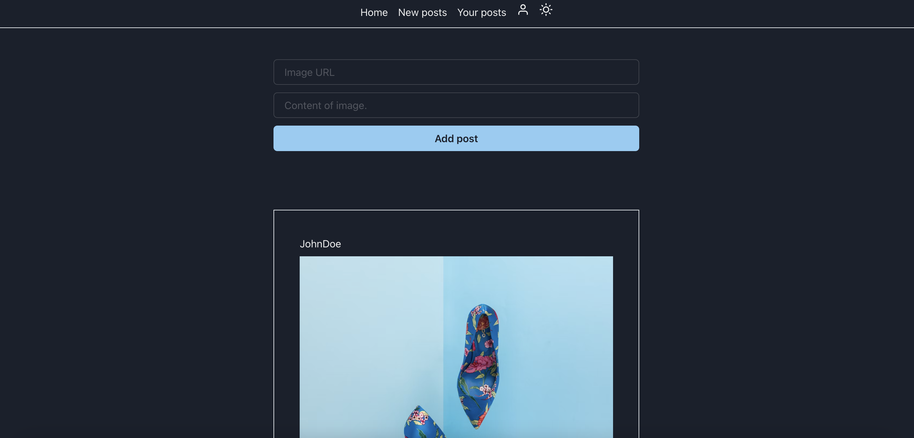

# PIAZZA APP CLIENT

[](https://github.com/merima98/piazza-app-client/blob/main/LICENSE)



### `Getting started`

```
    git clone https://github.com/merima98/piazza-app-client.git
    cd piazza-app-client
    yarn install
    yarn start
```

### `License`

[MIT](./LICENSE)
